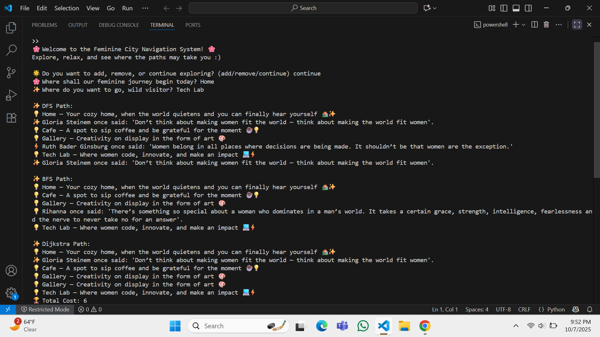
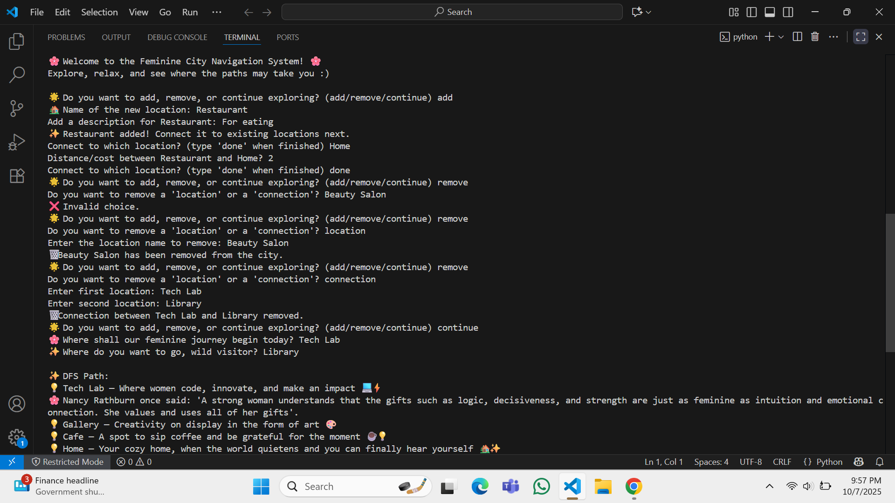

# 🌸 Feminine City Navigation System

This project is an interactive city-graph navigation system built around women's experiences, safety, and inspiring essence. This isn't just another coding exercise with pathfinding algorithms; it's a vision of what urban spaces could be when designed with feminine principles in mind.

**What if our cities felt as safe as home? What if they nurtured creativity like an art gallery? What if women felt truly empowered in tech spaces, continuing the legacy left by Ada Lovelace?**

This project brings those visions to life through the overlapping of technical depth and creativity, highlighting:

- **Purpose-Driven Design** 
- **Inspirational Experiences**
- **Three Path-Finding Algorithms** 
- **Interactive & Expandable City Building**

## 🚀 What You Can Do

Users can:
- **Navigate** using DFS, BFS, or Dijkstra's algorithm
- **Discover motivational quotes** from inspiring women throughout history
- **Personalize the city** by adding and removing locations or connections
- **Immerse themselves** in descriptive context for every location visited

## 🌟 Features

- 🌸 **DFS, BFS, Dijkstra** pathfinding algorithms
- 🌸 **Interactive CLI** for seamless city exploration  
- 🌸 **Rich location descriptions** & **bonus motivational quotes**
- 🌸 **Dynamic city management** (add/remove locations & connections)
- 🌸 **Safe, empowering, and thematic user experience**

## 📸 Screenshots


 
"Add screenshots to README"

##  🔮 Future Enhancements 

- GUI version with visual city map

- More themes and personalization options

- Save user's journey or favorite paths

- Web or mobile app adaptation

## 🛠️ Prerequisites

- Python 3.6 or higher  

---

## ⚡ Installation

**1. Clone the repository:**  
```bash
git clone https://github.com/yourusername/feminine-city-navigation.git
cd feminine-city-navigation

**2. Run the application:** 
python city_navigation.py

---
